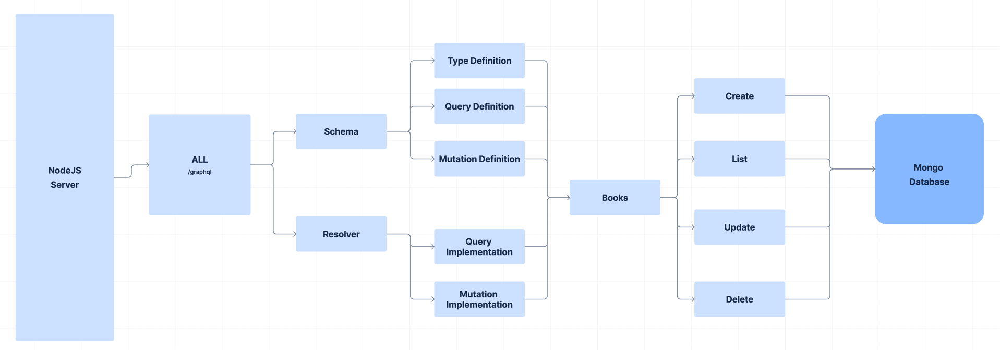

# Graphql-demo

### Technologies Used:

* NodeJS
* GraphQl
* Express
* MongoDb

### Server Architecture



### Setup Guide

Run the following command to get started

###### Install dependencies

`npm instal`

###### Setup .env

Add any mongoDb connection string to MONGO_DB_URI in .env

###### Start Server

`npm start`

server will start on port 4000

###### Visit Graphql UI dashboard to consume APIs

`http://localhost:4000`

This is how how the UI looks like


###### Run the following command to consume resources

###### Add Book

`mutation{   createBook(book:{title:"name",author:"author",price:123}){     _id     title     author     price   } }`

###### List Books

```
query {
  books {
    _id
    title
    author
    price
  }
}
```

###### Update Bookmutation

```
mutation{
updateBook(book:{title:"111"},id:"66a93afb281cea5e59ddc1d8"){
  _id
  title
  author
  price
} 
}
```

###### Delete Book`mutation{

```
mutation{

  deleteBook(id:"66a93afb281cea5e59ddc1d8"){
    deletedBook{
      _id
      title
      author
    }
    success
    message
  }
}

```
